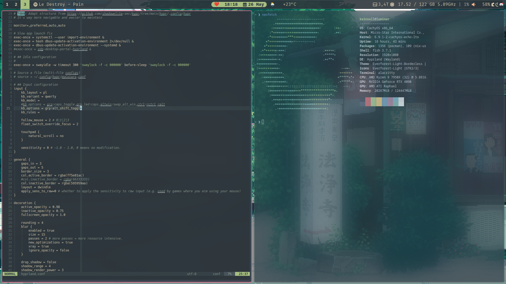

# ~/.dotfiles


---

## Getting Started

```bash
git clone https://github.com/keinsell/dotfiles ~/.dotfiles
make install
make install_hm
make hm
```


## Features

- Awful as hell, do not worry this will not look better (talking these about mismatched colours, misaligned icons and missing half of the features that you have in GNOME - but at least here are animations, not that they could not exist in gnome but...)
- `carapace`-based completions that either are not complete, miss-integrated or just doesn't work at all. Featuring `fish`-completions that are not working at all and `inshellisense` that just ruins everything.
- `nushell` as default shell to make life more complicated.
- `kitty` as terminal emulator with artistic artifacts as true **NVIDIA Experience** (TM).
- `helix` as modal editor, to make vim users mad.


## Themes

I always prefer to have multiple themes for different moods, the one usually I go with is `Sakura` however, recently I decided to switch to `Evergreen` for a while and in terms of `Cypherpunk` when I was using `nord` and `tokyo-night` I never matched it "correctly" with anything so I would say it's last preference.

- [`Evergreen`](https://github.com/sainnhe/everforest), the calm composition made on color of the forest. ([`miasma`](https://github.com/xero/miasma.nvim))
- [`Sakura`](https://rosepinetheme.com/),  All natural pine, faux fur and a bit of soho vibes for the classy minimalist.
- [`Cypherpunk`](https://github.com/folke/tokyonight.nvim), dark composition made with dark indigo and neon-like colors.


### Evergreen



| Spec      | Value | Description |
| ----------- | ----------- | ---- |
| GTK-Theme     | `everforest` | Available as `everforest-gtk-theme-git` package in AUR repository. |
| Theme | `everforest` | |
| Icons | | |
| Terminal | | |
| Notification Bar | `eww` | |
| Dock | | |

### Cypherpunkish

- GTK: [`tokyonight`](https://github.com/Fausto-Korpsvart/Tokyo-Night-GTK-Theme)

<!----------------------------------------------------------------------------->

## Fundamentals

| X                     |                                                  |                                                                                                                                                    |
|-----------------------|--------------------------------------------------|----------------------------------------------------------------------------------------------------------------------------------------------------|
| **Terminal Emulator** | `kitty`, `st`, `rio`, `alacritty`                |                                                                                                                                                    |
| **Shell**             | [`nushell`](dots/dot_config/nushell/README.md) | Nushell isn't mean to be used as login shell due to lack of POSIX compliance, however it's friendly shell that can be used as default in terminal. |
| **Modal Editor**      | `helix`                                          |                                                                                                                                                    |
| **Editor**            | `code`                                           | "Everybody eventually have VSCode installed on their machine"                                                                                      |
| **IDE**               | IntelliJ Family                                  |                                                                                                                                                    |
| **Web Browser**       | `floorp`, `surf`                                 |                                                                                                                                                    |
| **File Manager**      | `superfile`, `nemo`                              |                                                                                                                                                    |


## Installation

- Clone repository to `~/.local/share/chezmoi`
- Install dotfiles directory using `chezmoi apply`.
- Take a look at `/etc/profile` and adjust yours to match the functionality (optional, but recommended).


## Utilities

- [ThemeChanger](https://github.com/ALEX11BR/ThemeChanger), [Gradience](https://flathub.org/apps/com.github.GradienceTeam.Gradience) for modifing themes of `Qt` and `Gtk` applications.

<!----------------------------------------------------------------------------->

## Development

<!----------------------------------------------------------------------------->


<!----------------------------------------------------------------------------->

[Configure]: TODO
[Install]: TODO
[Quick Start]: TODO
