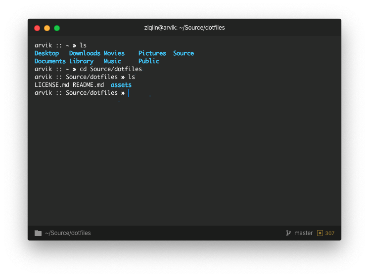

# `@ziqiln/dotfiles`

Repository with a little collection of my configuration files, and rice-guides.

## Hyper Terminal

`Hyper` is my favourite terminal emulator which makes provides a some kind of fun when using it, configuration is available at `.hyper.js` and should be placed in your home folder.

